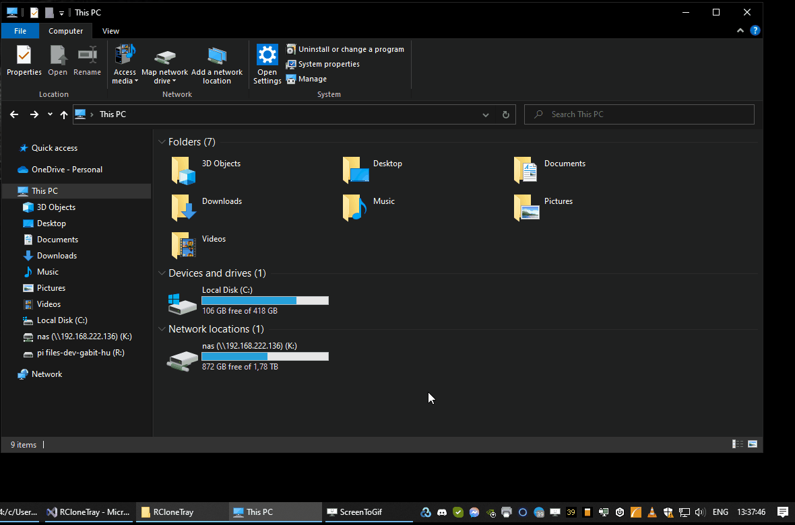

# RCloneTray

RCloneTray is a simple `rclone mount` helper.
Do what you want with it. WTFPL

## Install

Check `RCloneTraySetup/Release`  
Or build the solution yourself.  
3 remotes supported. Edit the source if you want more.

## RCloneTray Config

Edit `RCloneTray.dll.config` manually.  
Specify rclone.exe binary.  
Don't forget the `:` after the drive letter. Make sure drive letters are different.

```
<add key="rcloneRemote1" value="DRIVELETTER:;RCLONEREMOTE/MYSUBDIR"/>`
<add key="rcloneRemote1" value="R:;myRCloneRemote:/myDir"/>
```

```
<?xml version="1.0" encoding="utf-8" ?>
<configuration>
	<appSettings>
		<add key="rcloneBin" value="C:\DATA\rclone-v1.57.0-windows-amd64\rclone.exe"/>
		<add key="rcloneRemote1" value="R:;myRCloneRemote:/myDir"/>
		<add key="rcloneRemote2" value=""/>
		<add key="rcloneRemote3" value=""/>
	</appSettings>
</configuration>
```

## Example `%APPDATA%\rclone\rclone.conf`

```
[myRCloneRemote]
type = s3
provider = AWS
access_key_id = xxxxxxxxxxxxxxxxx
secret_access_key = yyyyyyyyyyyyyyyyyyyyyyyyyyyy
acl = private
region = eu-central-1
location_constraint = EU
```

## Screenshots



## License

WTFPL
